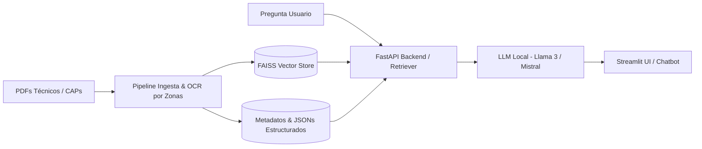

# Diseño de un Sistema de Extracción y Consulta Conversacional de Información Técnica de Nodos en Redes Móviles

[](https://www.python.org/)
[](https://fastapi.tiangolo.com/)
[](https://streamlit.io/)
[](https://opensource.org/licenses/MIT)

> **Trabajo de Fin de Máster (TFM)**
> **Autor:** Raúl Méndez López
> **Tutor:** Francisco José Martínez Zaldívar
> **Cotutor:** Rubén Martínez Talayero
> **Titulación:** Máster Universitario en Ingeniería de Telecomunicación
> **Institución:** Universitat Politècnica de València (UPV) — Escuela Técnica Superior de Ingenieros de Telecomunicación (ETSIT)
> **Entidad colaboradora:** Accenture

---

## 📡 Telco-CAP AI: Automated Extraction & Technical RAG System

> **Pipeline E2E para la digitalización, extracción estructurada y consulta conversacional (RAG local) de documentación técnica de estaciones base de telefonía móvil.**

---

## 📌 Contexto y Motivación

En el sector de las telecomunicaciones, los procesos de despliegue 5G y refarming de frecuencias exigen la revisión continua de **Certificados de Adecuación y Replanteo (CAP)**. Estos expedientes técnicos en formato PDF suelen presentar formatos heterogéneos, planos escaneados y tablas complejas, lo que convierte su análisis manual en un cuello de botella operativo, lento y propenso a errores humanos.

Para resolver este desafío, el proyecto implementa:

* **Pipeline ETL Híbrido:** Extracción determinista de metadatos críticos (coordenadas, consumos en DC, inventario de antenas/RRUs y PRL) combinando lectura vectorial de documentos y OCR guiado por zonas con anonimización de datos sensibles.
* **Arquitectura RAG Local:** Indexación semántica densa sobre FAISS que permite realizar búsquedas vectoriales contextuales por nodo en tiempos sub-milisegundo.
* **Asistente Técnico Conversacional:** Integración de LLMs locales (Llama 3, Mistral) orientada a responder consultas técnicas complejas, garantizando *grounding* sobre los documentos para eliminar alucinaciones y respetando la confidencialidad de los datos.

---

## 🏗️ Arquitectura del Sistema

El flujo de procesamiento sigue una arquitectura desacoplada y modular:



### 1. Ingesta y Extracción Guiada (Zone-based OCR & Parsers)

* **Preprocesamiento:** Extracción precisa de texto vectorial mediante `PyMuPDF` (`fitz`) y tablas mediante `pdfplumber`.
* **OCR Dirigido:** Algoritmos basados en `pytesseract` delimitados por cajas delimitadoras (bounding boxes) configurables vía JSON para documentos escaneados o sellados.
* **Normalización:** Transformación de coordenadas UTM a geográficas (WGS84), cálculo de balance de potencias (estado actual vs. reformado) y mapeo de tecnologías por sector (antenas MIMO, RRUs multibanda, cableado coaxial y fibra óptica).

### 2. Indexación y Búsqueda Vectorial (RAG Pipeline)

* **Chunking Semántico:** Segmentación del contenido técnico respetando las entidades clave del emplazamiento para no fragmentar tablas críticas.
* **Embeddings & Vector Store:** Generación de representaciones vectoriales densas indexadas en **FAISS (Facebook AI Similarity Search)** con persistencia local por clúster/nodo, garantizando búsquedas semánticas sub-milisegundo.

### 3. Inferencia Local y Mitigación de Alucinaciones

* Integración con modelos de lenguaje optimizados ejecutados 100% en local (vía Ollama / FastAPI):
  * **Llama 3 (8B Instruct)**
  * **Mistral (7B Instruct)**
  * **Zephyr (7B Beta)**
  * **Phi-3 Mini (3.8B)**
* Context-grounding: Las respuestas del modelo se fundamentan exclusivamente en los fragmentos recuperados del expediente del nodo solicitado.

### 4. Interfaz de Usuario (Frontend)

* Dashboard interactivo y conversacional desarrollado en **Streamlit**:
  * **CAP Bot (`chatbot.py`):** Asistente conversacional con memoria de contexto por sesión y selección dinámica de emplazamiento.
  * **Explorador Técnico (`app.py`):** Panel para benchmarking de respuestas entre diferentes LLMs y visualización transparente de los fragmentos recuperados.

---

## 🛠️ Stack Tecnológico

* **Lenguaje:** Python 3.10+
* **Procesamiento de Documentos:** `PyMuPDF` (`fitz`), `pdfplumber`, `pytesseract` (Tesseract OCR).
* **NLP & Embeddings:** HuggingFace `sentence-transformers`, LangChain.
* **Base de Datos Vectorial:** FAISS (`faiss-cpu` / `faiss-gpu`).
* **Modelos LLM:** Llama 3, Mistral, Zephyr, Phi-3 (Ollama / HuggingFace).
* **Backend API:** FastAPI, Uvicorn, Pydantic.
* **Frontend:** Streamlit.
* **Análisis de Datos:** Pandas, NumPy, OpenPyXL.

---

## 📂 Estructura del Repositorio

```text
├── backend/
│   ├── api/
│   │   └── main.py                  # API REST (FastAPI) para orquestación e inferencia
│   ├── etl/
│   │   ├── ocr/
│   │   │   ├── ocr_color.py         # Procesamiento visual y OCR basado en color/máscaras
│   │   │   └── ocr_text.py          # Extracción y OCR textual por coordenadas
│   │   ├── parsers/
│   │   │   ├── parse_coordenadas.py # Parsing y conversión de coordenadas (UTM/Geográficas)
│   │   │   ├── parse_identificadores.py # Normalización de IDs de emplazamiento y clúster
│   │   │   ├── parse_tablas.py      # Extracción de tablas de consumos, hardware y sectores
│   │   │   └── procesar_trabajos.py # Procesamiento de actuaciones de obra y PRL
│   │   ├── utils/
│   │   │   ├── coord_utils.py       # Utilidades matemáticas y geodésicas de coordenadas
│   │   │   └── pdf_utils.py         # Funciones auxiliares para manipulación y lectura de PDFs
│   │   ├── anon.py                  # Anonimización y sanitización de datos sensibles de cliente
│   │   ├── cap_extractor.py         # Orquestador de extracción técnica guiada por plantilla
│   │   ├── normalizar_json.py       # Esquematizado y validación de entidades JSON extraídas
│   │   └── pipeline_etl.py          # Pipeline completo de ingesta, procesamiento y guardado
│   ├── rag/
│   │   └── consultar_cap.py         # Motor de consulta RAG, context-building e inferencia LLM
│   ├── vectorization/
│   │   └── indexar_cap.py           # Segmentación, generación de embeddings e indexación FAISS
│   └── carga_datos.py               # Módulo de carga y lectura de metadatos estructurados
├── config/
│   └── config.json                  # Definición de coordenadas, cajas delimitadoras y layouts
├── data/
│   └── final/                       # Datasets/expedientes anonimizados listos para consulta
├── docs/                            # Memoria y documentación del TFM
├── frontend/
│   ├── app.py                       # Panel Streamlit para benchmarking de LLMs e inspección
│   └── chatbot.py                   # Asistente conversacional interactivo (Streamlit)
├── .gitignore                       # Configuración de exclusión de datos y binarios
└── requirements.txt                 # Dependencias del proyecto
```

---

## 🚀 Instalación y Despliegue

### Requisitos Previos

* Python 3.10 o superior.
* [Tesseract OCR](https://github.com/tesseract-ocr/tesseract) instalado en el sistema.
* [Ollama](https://ollama.ai/) para la ejecución local de los modelos LLM (o servicio compatible).

### 1. Clonar el repositorio y configurar el entorno

```bash
git clone [https://github.com/tu-usuario/telco-rag-cap-extraction.git](https://github.com/tu-usuario/telco-rag-cap-extraction.git)
cd telco-rag-cap-extraction

python -m venv venv
source venv/bin/activate  # En Windows: venv\Scripts\activate
pip install -r requirements.txt
```

### 2. Descargar modelos LLM recomendados (Ollama)

Asegúrate de que el servicio de Ollama esté en ejecución y descarga los modelos evaluados en el sistema (puedes empezar por el modelo por defecto, `llama3:8b`):

```bash
ollama pull llama3:8b-instruct-q4_0
ollama pull mistral:7b-instruct-v0.3-q4_0
```

### 3. Ejecución del Pipeline de Datos (ETL + Vectorización)

Ejecuta los módulos desde la raíz del proyecto para asegurar la correcta resolución de las rutas relativas y paquetes:

1. **Extracción y anonimización de documentos técnicos (ETL):**
   Procesa los expedientes situados en `data/` aplicando OCR por zonas, parsing y anonimización según `config/config.json`:

```bash
python -m backend.etl.utils.pipeline_etl
```

2. **Indexación y generación del almacén vectorial (FAISS):**
   Genera los embeddings semánticos y construye los índices vectoriales locales (`.faiss` y metadatos `.pkl`):

```bash
python -m backend.vectorization.indexar_cap
```

### 4. Lanzamiento de Servicios

Abre dos terminales (ambas con el entorno virtual activado):

Ejecuta los módulos desde la raíz del proyecto para asegurar la correcta resolución de las rutas relativas y paquetes:

* **Terminal 1 — API Backend (FastAPI):**
  Inicia el servidor backend que expone los endpoints de consulta y orquesta el retriever con el LLM:

```bash
	uvicorn backend.api.main:app --host 0.0.0.0 --port 8000 --reload
```

* Documentación Swagger interactiva disponible en:* `http://localhost:8000/docs`
* **Terminal 2 — Frontend (Streamlit):**
  Puedes ejecutar cualquiera de las dos interfaces según el caso de uso:

  ```bash
  # Asistente conversacional (CAP Bot):
  streamlit run frontend/chatbot.py

  # Panel de benchmarking de LLMs e inspección de fragmentos:
  streamlit run frontend/app.py
  ```

---

## 🔒 Privacidad y Cumplimiento de Datos

Este repositorio de código abierto ha sido preparado siguiendo directrices estrictas de confidencialidad:

* **Sin filtración de datos de cliente:** Todos los expedientes reales de infraestructura, identificadores comerciales de clientes y rutas internas corporativas han sido omitidos del control de versiones.
* **Privacidad por diseño (Local-First):** Al operar con modelos de embeddings y LLMs en local, ninguna consulta ni dato confidencial sale del entorno de cómputo local hacia APIs en la nube.

---

## ✒️ Autor y Contacto

* **Raúl Méndez López**
* **Titulación:** Ingeniero de Telecomunicación
* **LinkedIn:** [www.linkedin.com/in/raumenlo](https://www.linkedin.com/in/raumenlo/)
* **Email:** raumenlo26@gmail.com
